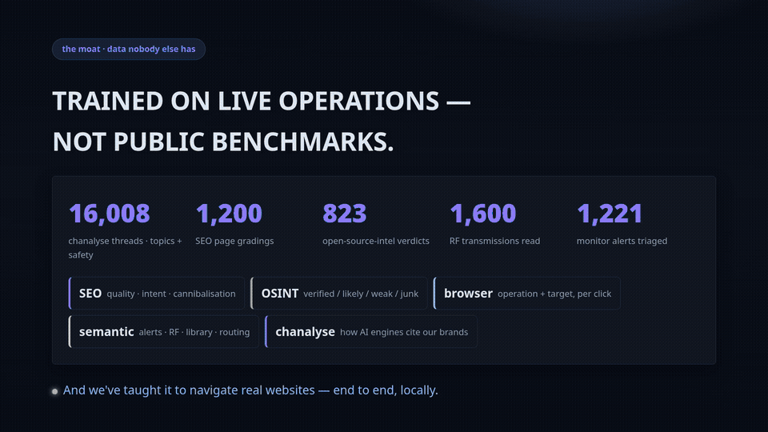

# GUT — Guided Unconscious Thinking

**A fine-tuned [Laya](https://github.com/Convai-Innovations/laya) decision engine: your systems' recurring judgments, distilled into a local model that runs on your hardware.**

GUT is the fast, instinctive judgment layer — System 1 — that acts before slow reasoning
is needed. It classifies anything (pages, hits, signals, alerts, threads), navigates real
websites autonomously, and serves the **exact same wire API** as a cloud decision engine
from your own machine: ~20 ms on a GPU, $0 marginal, private by default.

- Live instance: [gut.qalarc.com](https://gut.qalarc.com/)
- Weights: [huggingface.co/Qalarc/Laya-GUT-Finetune](https://huggingface.co/Qalarc/Laya-GUT-Finetune)
- Project page: [qalarc.com/projects/gut/](https://qalarc.com/projects/gut/)

<a href="https://gut.qalarc.com/#video"></a>

*GUT steering a live browser through the ASIC business-name registration workflow — every
hop is a real decision: options scanned, candidates weighed, choice made at ~20ms, training
row saved. **Full 80s film with sound at [gut.qalarc.com](https://gut.qalarc.com/#video)***

## How it works — three moves

```
collect → fine-tune + gate → serve
```

1. **Collect** — every verdict your systems make (a grade, a route, a label, a click) is
   logged as a training row with its **full probability distribution**. Soft labels keep
   the teacher's hedging; hard argmax labels destroy it.
2. **Fine-tune + gate** — RLCD loop (GRPO-style group sampling scored by a proper scoring
   rule + soft cross-entropy guidance), then a **hard gate on held-out data**: teacher
   agreement ≥ 0.85 AND calibration error ≤ 0.10 AND no collapsed labels.
   **No pass, no serve.** The audit trail is public — nine runs, zero registered so far,
   best calibration ECE 0.07.
3. **Serve** — a passing checkpoint registers behind `POST /v1/systemone` on
   `127.0.0.1:8798`, with an `X-Laya-Domain` header picking the specialist. One URL flips
   any cloud-built app to local.

## Quickstart

```bash
# capture: every Jev verdict becomes a soft-labeled training row
python scripts/jev_shadow_label.py --domain monitor-triage --n 1000

# train: RLCD + calibration + the gate (CPU here; the kernel pushes to free Kaggle T4s)
python mcp_finetune/train.py --dataset datasets/your-domain.jsonl --epochs 4 --device cpu

# read the gate table — agreement ≥ 0.85 and ECE ≤ 0.10, or it doesn't ship
cat checkpoints/your-domain-*/eval.json

# serve locally behind the cloud's exact API
python mcp_finetune/serve.py    # POST 127.0.0.1:8798/v1/systemone
```

## The domains trained so far

| Domain | Decides | Feeds |
|---|---|---|
| `monitor-triage` | severity · wake-the-owner · cause | alert pipeline |
| `osint-grading` | verified / likely / weak / junk | OSINT hit triage |
| `gmux-routing` | complexity · risk · tier routing | agent fleet dispatch |
| `rfai-feed` / `rfai-intent` | RF class + interest / intent + urgency | RF monitoring |
| `geo-attribution` / `geo-audit-triage` | AI-engine citation correctness / audit priority | brand monitoring |
| `seo-grading` | quality · intent · cannibalisation | SEO audits |
| `compliance-marks` | keep · canonical · on-theme | content moderation |
| `chanalyse` | thread topic (71) + safety | community analytics |
| `browser-ops` | operation + target per click | autonomous navigation |

Sample rows per domain live in `datasets/samples/` — the full datasets (23,500+ rows of
live operational data, soft-labeled) are qalarc's and available under CC BY-NC 4.0 on request.

## Browser autonomy

The `browser_agent/` app drives Playwright with typed decisions: every hop scans the
page's links, asks operation + target heads, shows its probabilities, and saves the row.
Task-directed walks stop at credential walls by design — the machine prepares every step,
the human signs. In the wild: it walked the ASIC business-name registration flow
end-to-end and halted exactly at the login.

## Repo map

```
mcp_finetune/    train.py (RLCD), serve.py (local endpoint), server.py (MCP tools)
scripts/         collectors, benchmarks, Kaggle kernel generator, investigators
browser_agent/   explorer, ops console, trace capture, gap replay
docs/            training areas, release notes, evaluation doctrine, design system
datasets/        samples/ only — full datasets on request
kaggle/          push-ready kernels (free 2×T4 training)
```

## License

Code: [PolyForm Noncommercial 1.0.0](LICENSE_POLYFORM.md) · datasets & weights: CC BY-NC 4.0 ·
commercial licensing via [qalarc.com](https://qalarc.com).

Built on [Laya](https://github.com/Convai-Innovations/laya) (Convai Innovations,
Apache-2.0) and the Jev/System One API (TypeSafe AI); browser loop via
browser-use/jev-ultrafast (MIT) and Playwright. See [ATTRIBUTION.md](ATTRIBUTION.md).
